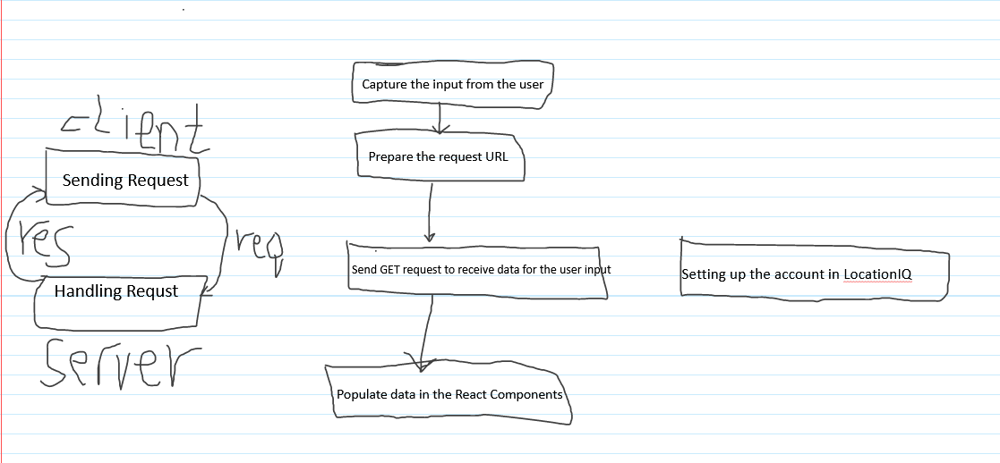

# City Explorer

  

**Author**: Abdelrahman Alasal

 

**Version**: 1.0.0 

 

## Overview

 

> Searching for locations provided from user, using LocationIQ API's

 

 

## Getting Started

 

> Clone this Repo

 

> In terminal Run: __npm install__

 

> In terminal Run: __npm install axios__

 

> In terminal Run: __npm install react-bootstrap bootsrap__

 

> Create Account at __www.locationiq.com__ to get an __API TOKEN__

 

> Create .env File in your root directory and add the a variable inside it for the token: REACT_APP_API_TOKEN 

 

 

## Architecture

 

> Its ReactJS based project 

 

> We are using Bootstrap for the styling

 

> We are using Axios to making requsts to the locationiq server 

 

> Components are Spreaded into 3 parts Header,Main,Footer , were Main contains Forms, DataCard, and Maps

 

## Change Log

 

> Finishing Static Maps Feature __2022-8-28 5:40PM__

 

## Credit and Collaborations

> Islam Alghoul 

